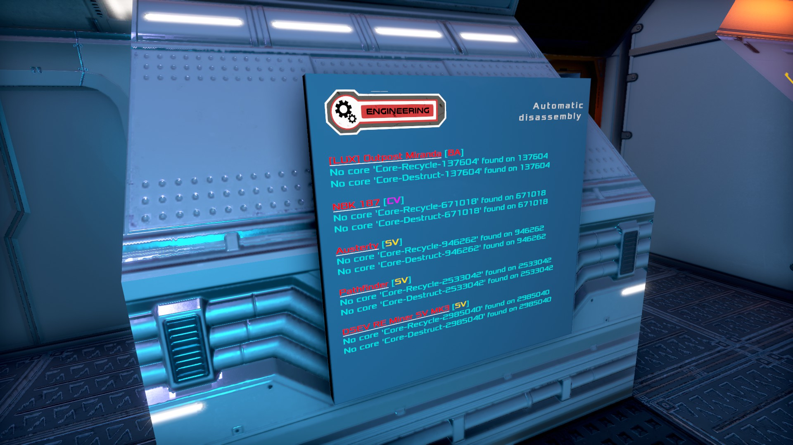

Decon Combo
-----------

These scripts are great for 'farming' POI's!

Once you've destroyed the core, place your own core on the structure, set it to the same faction of your vessel - faction or private, and it will get listed.
Then simply copy paste the displayed "name" to the POI's core-name (needs to be sorted).

Deconstruct will put 'whole' blocks into the given box (change script)
Recycle will put components with the same 'loss rate' as manual dissamble to components with the multi-tool into the given box (again, adjust the name in the script)

Make sure the box names are unique, preferable with your player name, or at the very least with the structure name, so you only use an asterix (\*) at the end, to allow the script to fill more than one box.

Plant Harvest:
--------------

Slightly more complex to set up