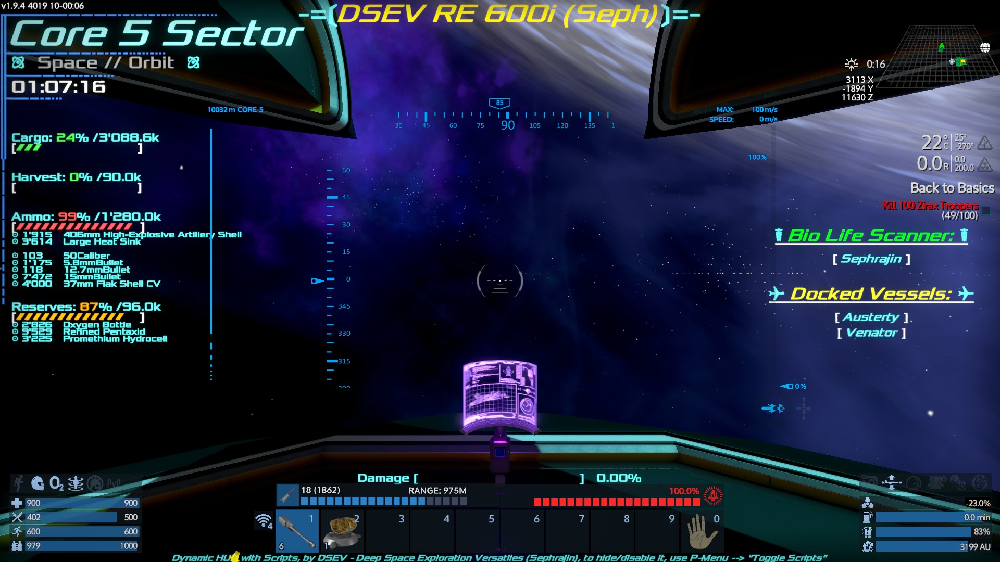
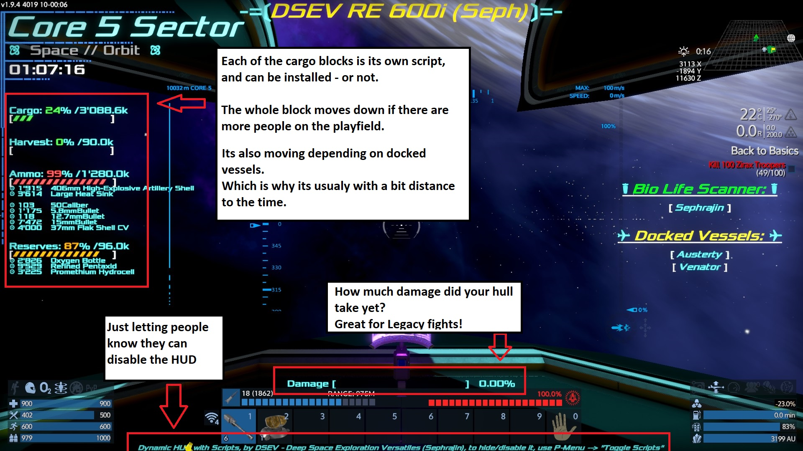

DSEV HUD
========

Deep Space Exploration Versatiles is proud to present you their HUD!

While it can work as a standalone script, it does come with a "module support".

Currently provided modules are:
* Ammo Containers (Bar, Content list)
* Cargo Containers (Bar)
* Harvest Containers (Bar)

By the simple use of wording the LCDs in a certain way, you can list them on the left side of the HUD!

Just name them: 

	Script:HUD_\*

For obvious reasons, it'll include them in numerical and alphabetical order, so everything after the lower dash starting with a "1" will be shown before a "z".

As the scripts are now, be aware to add the following +NUM values, however, feel free to change the numbers after HUD_:
* Script:[+3]HUD_1_Cargo
* Script:[+3]HUD_1_Harvest
* Script:[+11]HUD_2_Ammo
* Script:[+6]HUD_2_Reserves

The DSEV_HUD lcd/projector should have the following attributes:
* Height: 1.5
* Width: 1.75

It is designed to have the LCD on a 90° wall compared to the cockpit.  Meaning:
* Cockpit faces forward
* Projector is on the leftside of it, with its "wall side" towards the cockpit
* You apply a -90° Y-Rotation.
* And now just the regular X + Z Offsets.

