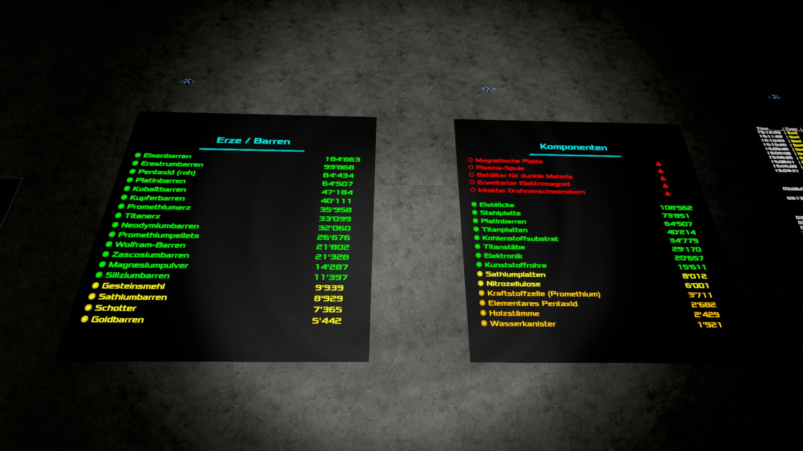

Info:
=====

While working with scripts, I consider it a **must have** to use [CultureInfo](./CultureInfo.lua)!

That said, the most simple script/s to illustrate its benefit are:
* [DateTime Small](./DateTime-Small-0.2x1.lua)
* [Status IO/components](./List-Box_Content/Structre_Item_Overview/Status-List_x3.lua)

Preview:
--------

